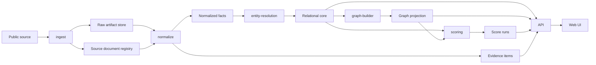

# OpenPolitics Lens Grand Design

## 結論

OpenPolitics Lens は「人物を評価するアプリ」ではなく、「公開資料から確認できる政治過程を、根拠付きの時系列と関係 graph として見るアプリ」として設計する。

最初の設計判断は次の通り。

- 正本は RDB に置く。Source Document、Evidence Item、正規化済み entity、event、score run を監査可能に保持する。
- 原本 HTML/PDF/CSV/JSON は object storage に不変保存する。
- GraphDB は探索用 projection とする。政治家、会派、政治団体、寄附、議案、採決、契約、補助金の関係 traversal に使う。
- 全文検索と embedding は「探す」ための補助であり、真実性の根拠にはしない。
- すべての表示は Evidence Item へ戻れることを UI/API の不変条件にする。

## Product Scope

対象は、公職上の行動と公開資料に限定する。

対象に含める。

- 会議録、委員会速記録、参考人発言、審議会議事要旨
- 議案、条例案、修正案、請願、陳情、採決・議決結果
- 政治資金収支報告書、政治団体名簿、政務活動費
- 予算、決算、補助金、入札、契約、指定管理
- 選挙公報、候補者アンケート、公式サイト、公式 SNS
- 公開された行政過程資料、パブコメ、審議会資料

対象外にする。

- 私生活、家族、住所、未確認の噂
- 匿名掲示板、出典不明の SNS 投稿、二次情報だけの断定
- 「裏で糸を引いた」「癒着した」など、公開資料から直接言えない断定

## Core User Experience

MVP の主要画面は 4 つ。

1. 人物ページ
   - 基本情報、会派、委員会、発言、議案関与、採決、政治資金、契約・補助金接点を時系列表示する。
2. 政策テーマページ
   - 例: 子育て、教育、公共事業。関連する発言、議案、予算、契約、資金接点を横断する。
3. Evidence viewer
   - AI 要約、抽出済み claim、原文、原本 URL、取得日時、parser version を分けて表示する。
4. Relationship graph
   - Public Actor と Source Document/Event/Funding/Public Money Flow の確認済み edge を表示する。推定 edge は別レイヤーにする。

## Module Boundaries

### ingest

外部資料を取得し、raw artifact と fetch metadata を保存する。API、HTML、PDF、CSV、検索フォーム、RSS の違いを吸収する。

責務:

- Source connector ごとの rate limit、retry、robots、利用条件管理
- content hash と canonical URL による重複検出
- 取得日時、HTTP header、etag、last-modified、connector version の記録
- 取得失敗・差分検知・再取得 queue

### normalize

raw artifact から構造化可能な項目を抽出し、統一形式へ変換する。

責務:

- 日付、金額、議案番号、会議名、会期、発言番号の正規化
- PDF/OCR 由来の表記揺れ検出
- Source Document と Evidence Item の切り出し
- extractor confidence と validation warning の保存

### entity-resolution

人物、団体、法人、会派、政治団体、契約先を名寄せする。自動確定と候補提示を分ける。

責務:

- exact key: 議員 ID、公式名簿 URL、法人番号、政治団体届出 ID
- fuzzy key: 表記揺れ、旧字体、肩書き、期間、所属、所在地粒度
- auto-merge せず、high-risk merge は admin review に回す

### graph-builder

RDB の正規化済み fact から graph projection を生成する。

責務:

- Relationship Edge の生成
- Edge ごとの evidence list、valid_from、valid_to、confidence、source priority の付与
- GraphDB への idempotent projection

### scoring

人物単体の断罪ではなく、政策テーマや資料集合に対する説明可能なスコアを計算する。

責務:

- 政策関与度、決定影響度、資金近接度、時系列一致、公約整合性、受益者接近度
- score run の versioning
- score factor と evidence contribution の保存
- UI 上の表示文言制御

### evidence

全 module 横断の最重要境界。表示・score・推定 edge から原資料へ戻すための契約を提供する。

責務:

- Evidence Item の ID 設計
- claim と source span の紐付け
- AI 要約と原文の分離
- source availability、license note、retrieved_at、archived_at の保持
- correction request と review trail の保持

### api

Web 向け read API。Evidence なしの表示を禁止する。

責務:

- 人物、政策テーマ、議案、発言、契約、団体、graph query
- Evidence bundle を常に返す
- public API と admin API の分離

### web

検索、人物ページ、政策テーマページ、関係 graph、時系列、訂正申請を提供する。

責務:

- 要約と原文の明確な分離
- 推定・確認済み・未検証の視覚的分離
- すべての表示に一次資料 link
- 誤解を生む ranking や断定ラベルの回避

## Data Flow



## Data Store Design

### RDB: system of record

採用: PostgreSQL 18。

ローカル開発では Docker Compose の `postgres` service として `postgres:18.4-trixie` を使う。PostgreSQL は引き続き system of record であり、GraphDB、検索 index、object storage の projection や materialized view より優先される。

主に保持するもの:

- `source_documents`
- `raw_artifacts`
- `evidence_items`
- `evidence_claims`
- `public_actors`
- `actor_identifiers`
- `organizations`
- `memberships`
- `meetings`
- `speeches`
- `bills`
- `bill_events`
- `vote_positions`
- `funding_contacts`
- `public_money_flows`
- `relationship_edges`
- `entity_resolution_candidates`
- `score_runs`
- `score_factors`
- `correction_requests`
- `audit_logs`

RDB を正本にする理由:

- Evidence の完全性制約、unique constraint、foreign key、監査 log を持ちやすい。
- admin review、訂正申請、parser 再実行、score 再計算の履歴管理がしやすい。
- GraphDB だけでは source span、抽出 version、review state、legal state の管理が崩れやすい。

### Object storage: immutable raw artifacts

採用: S3 compatible storage。ローカル開発では MinIO を使う。

Docker Compose では `minio` service を `quay.io/minio/minio` 系 image で起動し、`minio-init` service が `openpolitics-raw` bucket を作成し versioning を有効化する。raw artifact は RDB の `raw_artifacts` record と content hash で対応付ける。

保存 key 例:

```text
raw/{source_id}/{yyyy}/{mm}/{content_hash}.{ext}
```

保持する metadata:

- original URL
- fetched_at
- content_hash
- media_type
- connector_version
- license note
- retrieval status

### GraphDB: relationship projection

採用: Neo4j。

ローカル開発では Docker Compose の `neo4j` service として Neo4j Community Edition を起動する。Neo4j は開発速度、可視化、Cypher、周辺 tooling を理由に採用する。

GraphDB は正本ではなく projection。再生成可能であることを不変条件にする。

### Search index

採用: Meilisearch。

ローカル開発では Docker Compose の `meilisearch` service として起動する。日本語全文検索、facet、highlight、source document search に使う。検索結果は Evidence Item に戻す。

### Local Docker Compose endpoints

ローカル datastore 構成の詳細は [Local Infrastructure](local-infrastructure.md) を正とする。host からの接続は loopback に限定し、アプリケーション container からは Compose network 上の service name で接続する。

### Vector index

推奨: MVP 後。使う場合も「似た資料を探す」ための補助に限定する。要約や推定の根拠として単独使用しない。

## API Contract

read API は次の契約を守る。

- 表示用 entity は `evidence[]` を必ず持つ。
- score は `score`, `factors[]`, `method_version`, `computed_at`, `evidence[]` を必ず返す。
- inferred edge は `inference_method`, `confidence`, `supporting_evidence[]`, `counter_evidence[]` を必ず返す。
- AI-generated summary は `summary_type=ai_generated` とし、原文 field と混ぜない。

## Operations

最初から必要な運用機能:

- connector ごとの取得成功率、最終取得日時、差分件数
- parser warning dashboard
- entity-resolution review queue
- correction request queue
- source takedown / unavailable state
- score run reproducibility
- audit log export

## Security And Abuse Controls

- public write は correction request のみ。認証、rate limit、spam 対策を必須にする。
- admin 画面は強い認証と操作 audit log を必須にする。
- 未検証の投稿や外部告発を fact として保存しない。
- 秘密情報、非公開住所、家族情報、センシティブな私生活情報の ingest を禁止する。

## MVP Definition

最初の MVP は東京都を対象にする。政策テーマは 1 つに絞り、取得資料は 5 種に限定する。

対象:

- 東京都議会
- 政策テーマ: 教育・子育て、または公共事業のどちらか 1 つ

資料:

1. 会議録・速記録
2. 提出議案と議決結果
3. 選挙公報・選挙結果
4. 政治資金収支報告書
5. 予算・契約情報

成果:

- 1 人の都議ページ
- 1 政策テーマページ
- 根拠付きタイムライン
- 関係 graph の read-only 表示
- 訂正申請フォームの最小実装

## Grill Question 1

最初に固めるべき問いは「MVP の主語を自治体にするか、政策テーマにするか」。

推奨回答: 自治体を東京都に固定し、その中で政策テーマを 1 つに絞る。理由は、自治体横断よりも source connector と entity-resolution のばらつきが小さく、Evidence-first の基盤検証が早いから。

## 関連ページ

- [Domain Model](domain-model.md) — 用語とデータ構造の境界。
- [Data Sources](data-sources.md) — 取得元と自治体候補。
- [Scoring](scoring.md) — スコア計算の根拠設計。
- [Legal And Evidence Risk](legal-risk.md) — 表示文言と訂正導線。
- [Roadmap](roadmap.md) — 導入順序。
- [Official Data Source Check](wiki/sources/2026-07-03-official-data-source-check.md) — 公式ソース確認。

## 出典

- [Official Data Source Check](wiki/sources/2026-07-03-official-data-source-check.md)
